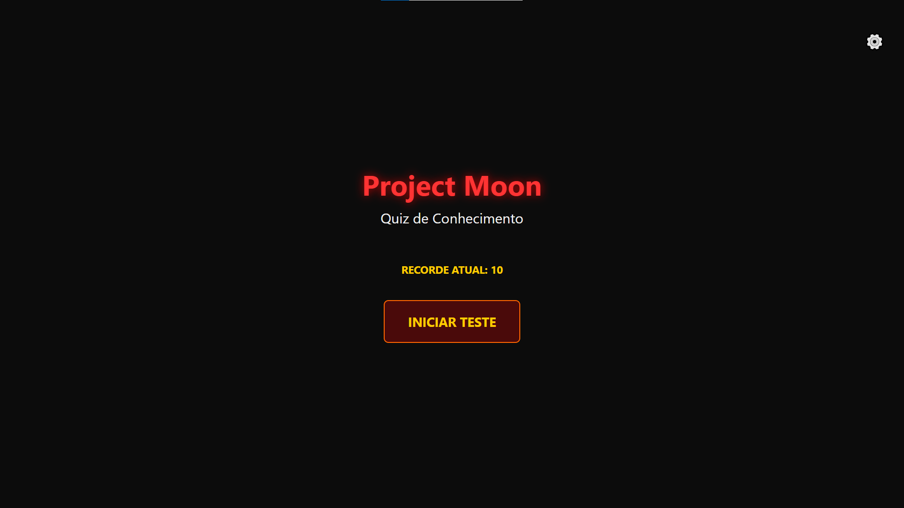
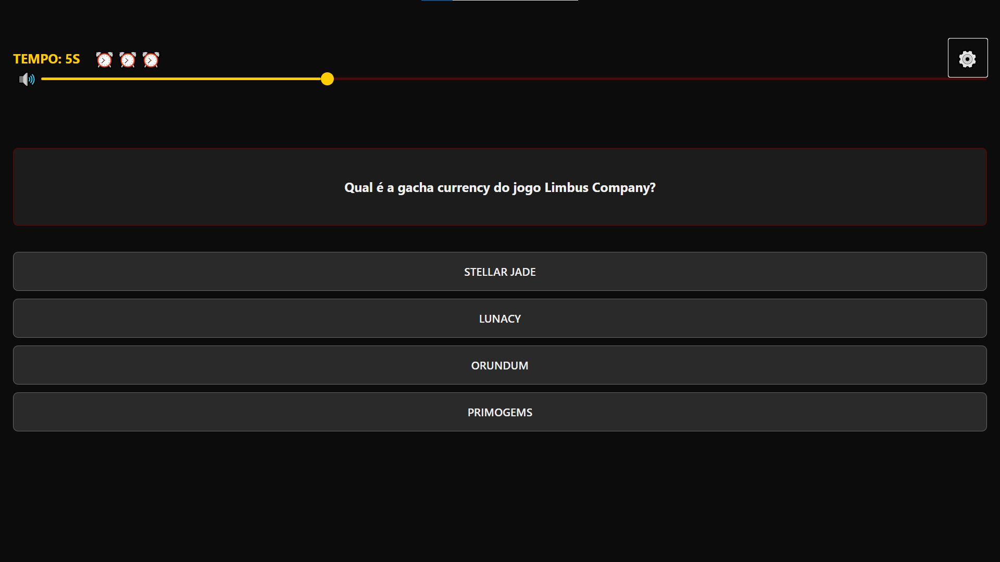
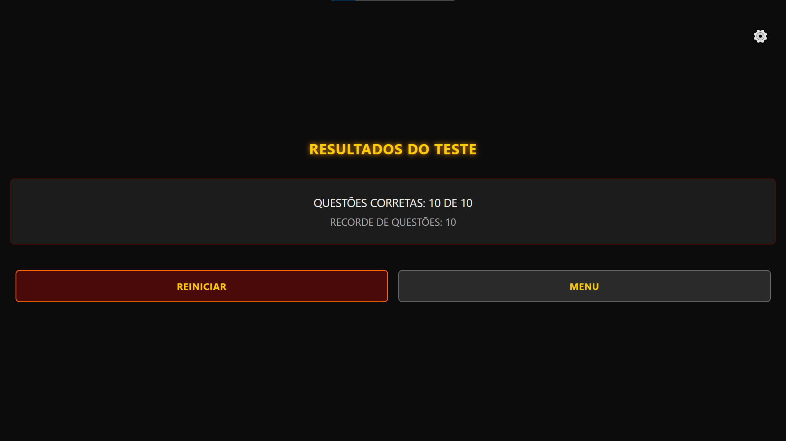

# 🐙 Project Moon / Limbus Company - Quiz App

Este é um projeto [Expo](https://expo.dev) que começou como um template padrão e foi transformado em um quiz temático e interativo sobre o universo de Project Moon, com foco em Limbus Company.

## 🚀 Como Iniciar

1.  **Instalar dependências**
    Execute o comando abaixo para instalar todos os pacotes necessários para o projeto.
    ```bash
    npm install
    ```

2.  **Iniciar o aplicativo**
    Este comando iniciará o servidor de desenvolvimento Metro, permitindo que você execute o aplicativo em um emulador ou no seu próprio dispositivo.
    ```bash
    npx expo start
    ```

Na saída do terminal, você encontrará opções para abrir o aplicativo em:
* Um emulador Android ([Android emulator](https://docs.expo.dev/workflow/android-studio-emulator/))
* Um simulador iOS ([iOS simulator](https://docs.expo.dev/workflow/ios-simulator/))
* No seu dispositivo via [Expo Go](https://expo.dev/go)

---

## ✨ Funcionalidades Implementadas

O projeto foi aprimorado com diversas funcionalidades para criar uma experiência de jogo mais dinâmica, imersiva e com a cara do universo de Limbus Company.

### ⚙️ Funcionalidade: Sistema de Jogo Completo com Vidas e Cronômetro
* **Descrição:** O jogador começa com 3 vidas (representadas pelo relógio do Dante ⏰). A cada erro, ou se o tempo de 15 segundos para responder a uma pergunta se esgotar, uma vida é perdida. O jogo termina se o jogador perder todas as vidas ou responder a todas as perguntas.
* **Desafios e Aprendizados:** Para implementar o cronômetro, foi necessário utilizar os Hooks `useState` e `useEffect` do React. O `useEffect` foi crucial para gerenciar o ciclo de vida do timer (iniciando, atualizando a cada segundo e limpando ao trocar de pergunta) de forma eficiente e sem vazamentos de memória.

### 🎲 Funcionalidade: Aleatoriedade e Rejogabilidade
* **Descrição:** Para garantir que cada partida seja única, tanto a ordem das perguntas quanto a ordem das alternativas de cada pergunta são embaralhadas no início de cada novo jogo.
* **Desafios e Aprendizados:** A implementação exigiu a criação de uma função de embaralhamento baseada no algoritmo de Fisher-Yates. O desafio foi aplicar essa função de forma a não alterar o estado original das perguntas (`questions.json`) e integrar o resultado ao estado do React para re-renderizar a tela com a nova ordem.

### 💾 Funcionalidade: Persistência de Recorde (High Score)
* **Descrição:** A maior pontuação do jogador é salva localmente no dispositivo. Ao final de uma partida, se a pontuação atual for maior que o recorde salvo, ele é atualizado. O recorde é exibido na tela de menu e na tela de resultados.
* **Desafios e Aprendizados:** Foi necessário pesquisar e utilizar a biblioteca `@react-native-async-storage/async-storage` para persistir dados. O principal desafio foi lidar com as operações assíncronas de salvar (`setItem`) e carregar (`getItem`) o recorde, garantindo que o valor seja recuperado corretamente quando o aplicativo é iniciado.

### 🎵 Funcionalidade: Efeitos Sonoros e Música Ambiente com Controles
* **Descrição:** O quiz possui uma música de fundo que muda entre a tela de jogo e a tela de resultados. Efeitos sonoros são tocados para respostas certas e erradas. O jogador tem controle total sobre o áudio através de um botão para mutar/desmutar e um slider de volume para a música. Um botão de "configurações" (⚙️) permite exibir ou ocultar esses controles, mantendo a interface limpa.
* **Desafios e Aprendizados:** Foi a funcionalidade mais complexa. Exigiu o uso da biblioteca `expo-av` para carregar e reproduzir múltiplos sons. O gerenciamento do estado dos players de áudio com `useRef` foi essencial para evitar bugs de recarregamento e vazamentos de memória. Além disso, foi necessário instalar e configurar o pacote `@react-native-community/slider` para criar o controle de volume.

### 🕹️ Funcionalidade: Navegação por Estados e Menu Principal
* **Descrição:** O aplicativo possui uma estrutura de navegação baseada em três estados: "menu", "jogando" e "finalizado". Isso proporciona uma experiência de usuário mais clara, com uma tela de menu inicial onde o jogador pode ajustar o som antes de começar, e a opção de voltar para ela após o término do quiz.
* **Desafios e Aprendizados:** O desafio foi refatorar o código, que antes usava múltiplos `useState` booleanos, para um único `useState` de estado (`gameState`). Isso tornou o código mais limpo, previsível e resolveu bugs de lógica, como o da música que não tocava no primeiro início do jogo.

---

### 🖼️ Demonstração

| Tela de Menu | Tela de Jogo | Tela de Resultados |
| :---: | :---: | :---: |
|  |  |  |